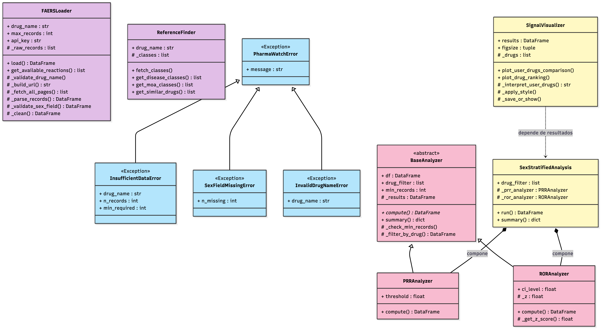

# 💊 PharmaWatch

**Plataforma Python de farmacovigilancia con perspectiva de sexo.**

PharmaWatch detecta señales de riesgo diferencial en medicamentos comparando patrones de efectos adversos entre mujeres y hombres. Para ello, extrae y analiza datos públicos del sistema FAERS (FDA Adverse Event Reporting System) utilizando la API de openFDA.

## Características Principales

* **Carga Automatizada de Datos:** Conexión directa y paginada a la API de openFDA para descargar reportes de efectos adversos validados.
* **Análisis Estadístico Estratificado:** Implementa algoritmos estándar de farmacovigilancia calculados de forma independiente para hombres y mujeres:
  * *PRR (Proportional Reporting Ratio)*
  * *ROR (Reporting Odds Ratio)*
* **Búsqueda de Fármacos de Referencia:** Integración con la API RxNorm (NIH) para buscar automáticamente fármacos similares por indicación terapéutica o mecanismo de acción.
* **Visualización de Señales:** Generación automática de gráficos (Matplotlib) para comparar el riesgo entre los fármacos seleccionados y mostrar un ranking general.
* **Pipeline Interactivo:** Interfaz de terminal paso a paso fácil de usar.

---

## Instalación

El proyecto requiere **Python 3.9 o superior**.

1. Clona el repositorio:
   ```bash
   git clone [https://github.com/tu-usuario/pharmawatch.git](https://github.com/tu-usuario/pharmawatch.git)
   cd pharmawatch
2. Instala las dependencias necesarias. Puedes hacerlo mediante el archivo de requerimientos:
   ```bash
   pip install -r requirements.txt
   ```
   *O instalando el paquete localmente usando el archivo de configuración:*
   ```bash
   pip install .
   ```

**Dependencias principales:** `pandas` (>=2.0), `matplotlib` (>=3.7), `requests` (>=2.31), `numpy` (>=1.21).

---

## Uso

Para ejecutar la herramienta, simplemente lanza el pipeline interactivo desde la terminal. El script te guiará paso a paso pidiéndote los fármacos a analizar y si deseas añadir fármacos de referencia.

```bash
python main.py
```

### Ejemplo de flujo:
1. Introduce el fármaco(s) a analizar (ej. `ibuprofen`, `aspirin`).
2. Decide si quieres añadir fármacos similares de referencia automáticamente.
3. La plataforma descargará los datos, calculará PRR y ROR, y te mostrará una tabla resumen en consola.
4. Generará gráficos de comparación si así lo solicitas.

---
## Modulos

El proyecto está diseñado de forma modular siguiendo los principios de la Programación Orientada a Objetos (POO). Los componentes principales son:

* **`loader`**: Carga y validación de datos vía openFDA API. Maneja la paginación y la limpieza inicial de los registros.
* **`analyzer`**: Contiene la lógica estadística. Implementa `SexStratifiedAnalysis` para la detección de señales PRR y ROR calculadas de forma independiente para mujeres y hombres.
* **`reference_finder`**: Búsqueda automática de fármacos similares conectándose a la API de RxNorm (NIH).
* **`visualizer`**: Generación de gráficos comparativos utilizando `matplotlib` para interpretar fácilmente las señales.
* **`exceptions`**: Jerarquía de excepciones personalizadas (`PharmaWatchError`, `InsufficientDataError`, etc.) para el manejo robusto de errores.
* **`main`**: Orquestador principal que define el pipeline de ejecución interactiva en terminal.

---
## UML diagram


---
## Examples
Además del uso interactivo mediante `main.py`, puedes utilizar los módulos de PharmaWatch directamente en tus propios scripts de Python.

**1. Búsqueda de fármacos similares (RxNorm)**
```python
from pharmawatch.reference_finder import ReferenceFinder

finder = ReferenceFinder("ibuprofen")
finder.fetch_classes()

# Buscar fármacos con el mismo mecanismo de acción (MOA)
similar_drugs = finder.get_similar_drugs(class_id="N0000175722", rela="has_moa", top_n=5)
print(similar_drugs)
```

**2. Visualización de resultados**
```python
from pharmawatch.visualizer import SignalVisualizer

# Suponiendo que 'results' es el DataFrame generado por el analyzer
viz = SignalVisualizer(results=results)

# Generar gráfico comparando fármacos específicos
viz.plot_user_drugs_comparison(drugs_to_analyze=["ibuprofen", "aspirin"])

# Generar ranking general basado en una indicación terapéutica
viz.plot_drug_ranking(disease_label="Pain")
```
---
## Licencia

Este proyecto se distribuye bajo la licencia **MIT**. Consulta el archivo `LICENSE` para más detalles.

## Referencias

* Evans, S.J.W. et al. (2001). *Use of proportional reporting ratios (PRRs) for signal generation from spontaneous adverse drug reaction reports.* Pharmacoepidemiology and Drug Safety.
* APIs utilizadas: [openFDA](https://open.fda.gov/apis/drug/event/) | [RxNorm (NIH)](https://rxnav.nlm.nih.gov/)